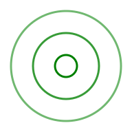

## Wave

  

Waveは,波動を触って視覚的に体感するためのツールです。

[Wave を開く](https://akimikimikimikimikimikimika.github.io/Wave/Wave.html "Wave")  

[ソースコード](https://github.com/akimikimikimikimikimikimika/Wave/ "ソースコード")

### 基本
- ページ内でタップ又はクリックすると,そこを波源として,波を発する。
- ホールドしている(タップ/クリックしたままでいる)と,一定間隔で波を発し続ける。
- 左上のボタンを押すと,ページ上部にメニューを表示する。(デスクトップでは,Mキーでメニューのオン/オフを切り替えられる)
- 複数の波源を選択するには,複数の波源に同時に触れるか,Shiftキーを押しながら波源を選択していく。

### メニュー
- Hボタン(Hキー)を押して,タップ/クリックせずとも波源をホールドし続ける。
- Eボタン(Eキー)を押して,編集モードのオン/オフを切り替え。
- Dボタン(Dキー)を押して,ダークモードのオン/オフを切り替え。

### 編集モード
- 出力波の調節ができる。
- 2次元グラフで調整。
- 原点の位置にセットすると標準設定になる。
- x方向は振動数であり,1分間の振動回数で表示する。
- y方向は波長であり,標準設定での波長からの相対値で表示する。

### 特記事項
- JavaScript,CSSを無効にすると利用できない。
- 同じURLでそのままデスクトップでも,モバイルでも利用できる。
- Safariのみ動作。Chrome,Firefoxでは適切に動作しない。
- 当然のことであるが,Internet Explorerでも利用できない。
- 上記の理由により,AndroidやWindows等のデバイスでは正常に動作しない。
- iOSデバイスでは,ホーム画面にアイコンを追加すると,スタンドアロンで開く。
- iPhone X 対応。

### 更新内容
- Service Worker の導入に伴い,ソースコードをオンライン版に統一。オフライン環境に入るとオンライン時に保存したキャッシュから読み込まれるので,オフラインでも利用可能。